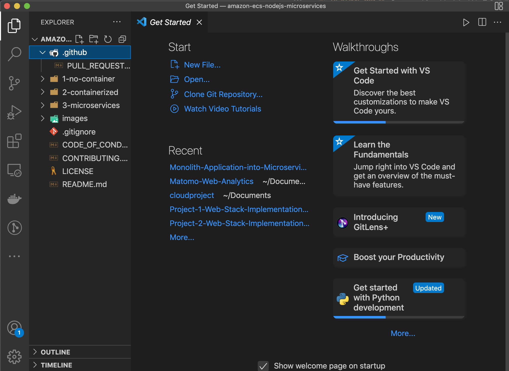
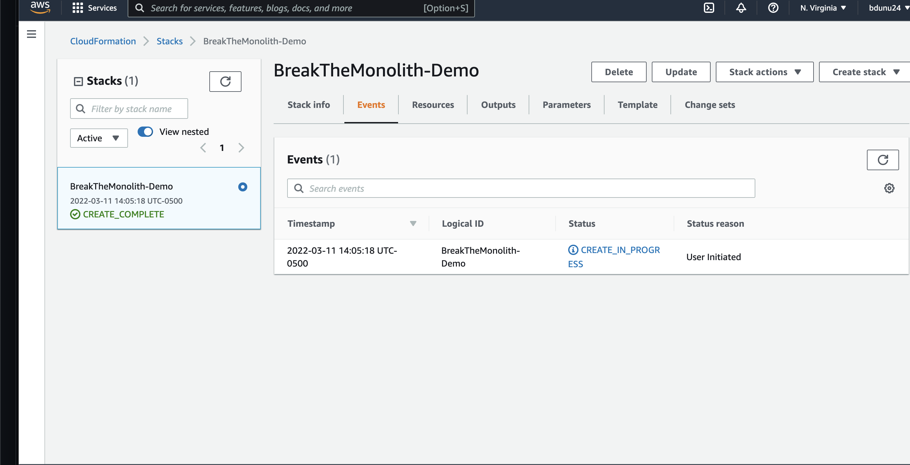

# Monolith-Application-into-Microservices

## Introduction

Hello, and welcome! 

In today’s project we’ll be deploying a monolithic node .js application to a Docker container. Then, we will be breaking the monolith application into microservices, with zero downtime. The node.js application will host a simple message board with threads and messages communicating between users.

### What is a Monolith? Why Migrate to Microservices?

A **monolith** is an application that’s a single unit of deployment, handling multiple kinds of business services. It is usually all tightly grouped together. Difficulties may potentially arise as an application’s code base grows––it becomes complicated to update and maintain, which makes a traditional monolithic architecture hard to scale.

On the other hand, **microservices** take each core of those business services, and deploy as its own separate unit, which preforms only a single function. They communicate with other services through a well-defined Application Programming Interface (API). Microservices can be written using different frameworks and programming languages, and you can deploy them independently, as a single service, or as a group of services.

Both the monolithic and miniservices applications are secured and maintained using containers. **Containers** provide a standard way to package your application's code, configurations, and dependencies into a single object. Containers share an operating system installed on the server and run as resource-isolated processes, ensuring quick, reliable, and consistent deployments, regardless of environment. 

### Why use containers?

**Containers** are a powerful way for developers to package and deploy their applications. Some benefits of using them are:

- **Less overhead**
    >> Containers require less system resources than traditional or hardware virtual machine environments because they don’t include operating system images.

- **Increased portability**
    >> Applications running in containers can be deployed easily to multiple different operating systems and hardware platforms.

- **More consistent operation**
    >> DevOps teams know applications in containers will run the same, regardless of where they are deployed.

- **Greater efficiency**
    >> Containers allow applications to be more rapidly deployed, patched, or scaled.

- **Better application development**
    >> Containers support agile and DevOps efforts to accelerate development, test, and production cycles.

# Part One: System Setup

As mentioned in the beginning, we'll be breaking a monolith application into microservices. Prior to this, we'll need to ensure we have access to a few software and tools. Let's get started!

### Step One: Creating an Amazon Web Services (AWS) Account

If you do not already have an AWS account set up, please create a free one [here](https://portal.aws.amazon.com/gp/aws/developer/registration/index.html). 

### Step Two: Installing Docker

Next, we'll install Docker. Docker is an open-source project for automating the deployment of applications as portable, self-sufficient containers that can run on the cloud or on-premises. We'll use this to build the image files that will run in our containers. 

Follow either the [Mac](https://docs.docker.com/docker-for-mac/install/) or [Windows](https://docs.docker.com/docker-for-windows/install/) instructions to have this downloaded to your desktop.

Once installed we can verify it is running by entering the following command in the terminal:

    docker --version

The version number should display as below: 

### Step Three: Installing the AWS Command Line Interface (CLI)

The AWS CLI is what we'll be using to push the images to Amazon ECR. Please follow this [guide](http://docs.aws.amazon.com/cli/latest/userguide/installing.html) to download and learn more about AWS CLI. 

Once downloaded and installed, verify that it is running on your terminal by running:

    aws --version

 If you already have AWS CLI installed, run the following command in the terminal to ensure it is updated to the latest version:

    $ pip3 install awscli --upgrade --user

### Step 4: Downloading a Text Editor for Coding

If you don't already have a text editor for coding, install one to your local environment! Both [Atom](https://atom.io/) and [Visual Studio Code](https://code.visualstudio.com/) are simple, open-source text editors that are popular with developers.

For today's example, we'll utilize VS Code.

### Step 5: Downloading the Repository from Github

If you haven't already created an account with Github, go ahead and do so [here](https://github.com/).

Next, log into your account and navigate to the following repo on your web browser: https://github.com/awslabs/amazon-ecs-nodejs-microservices

Select 'Code' and then click 'clone link,' in order to download the GitHub repository to your local environment.

There are two ways to clone your repo:

1. Open up your text-editor and use the 'Clone Repository' tab on the left-hand side. You'll have the option of entering in your cloned URL from github there. You may be asked where on your PC you'd like to save your repository. Once you do so, you will have access to the *amazon-ecs-nodejs-microservices* repository we cloned from Github.

2. You can clone the repo to your Terminal, using the following command:

    $ git clone <clone-link>

### Step Six: Creating the Repository on AWS

Now head to the [Amazon ECR console](https://console.aws.amazon.com/ecs/home?#/repositories) and select **Create Repository.**

On the Create repository page, enter the following name your repository: *api*

Leave the remainder of the options as default settings, then select *Create Repository*.

Once the repository is created, you'll notice a confirmation message displayed, showing the repository address. The repository address is in the following format: [account-ID].dkr.ecr.[region].amazonaws.com/[repo-name].

 **Disclaimer:** Things in brackets, such as the [account-ID], [region], and [repo-name] will be unique to your setup.

Next, access your terminal and navigate to the following directory:

    cd ~/amazon-ecs-nodejs-microservices/2-containerized/services/api.

Once you're in the directory, use the following command to configure your account:

    $ aws configure

Replace the following sample values below with your own values:

    AWS Access Key ID [None]: Access Key
    AWS Secret Access Key [None]: Secret Key
    Default region name [None]: <your preferred region>
    Default output format [None]: json

For additional help with AWS configuration, click [here](https://docs.aws.amazon.com/cli/latest/userguide/cli-configure-quickstart.html):

### Step Seven: Using the Terminal to Authenticate Docker Log-In

1. In your terminal, run:

    $ aws ecr get-login-password \
        --region <region> \
    | docker login \
        --username AWS \
        --password-stdin <aws_account_id>.dkr.ecr.<region>.amazonaws.com

2. To build the image, run the following command in the terminal:

    $ docker build -t api .

3. After the build completes, tag the image so you can push it to the repository:

    $ docker push [account-id].dkr.ecr.[region].amazonaws.com/api:latest

**Disclaimer:** Please remember to replace values within brackets, such as the [account-ID] and [region], as they will be unique to your setup.

4. Push the image to Amazon ECR by running the following:

    $ docker push [account-id].dkr.ecr.[region].amazonaws.com/api:latest

If you navigate to your Amazon ECR repository, you should now see your image tagged:

# Part Two: Deploying the Monolith

In part two, we'll be using Amazon Elastic Container Service (Amazon ECS) to instantiate a managed cluster of EC2 compute instances and deploy our image as a container running on the cluster. 

We'll begin by creating an Amazon ECS cluster deployed behind an Application Load Balancer.

1. Navigate to the AWS CloudFormation console and select **Create stack.**

Select on **Upload a template file** and choose the ecs.yml file from the GitHub project at amazon-ecs-nodejs-microservice/2-containerized/infrastructure/ecs.yml––then select **Next.**

Enter *BreakTheMonolith-Demo* as the stack name. Once completed, verify that the other parameters have the following values:

- **Desired Capacity** = *2*
- **InstanceType** = *t2.micro*
- **MaxSize** = *2*

Select **Next**

On the Configure stack options page, keep the default options and scroll down and select **Next.**

On the **Review BreakTheMonolith-Demo** page, scroll to the bottom of the page. Acknowledge the **Capabilities** statement by selecting the checkbox, and select **Create stack**.

You will see your stack with the status *CREATE_IN_PROGRESS.* This process typically takes under 5 minutes. You can select the refresh button at the top right of the screen to check on the progress.

Alternatively, you can use the AWS CLI to deploy AWS CloudFormation stacks. Run the following code in the terminal from the folder amazon-ecs-nodejs-microservices/3-microservices and replace [region] with your AWS Region:

    $ aws cloudformation deploy \
        --template-file infrastructure/ecs.yml \
        --region [region] \
        --stack-name BreakTheMonolith-Demo \
        --capabilities CAPABILITY_NAMED_IAM

2. Ensure that your Cluster is Running

Navigate to the [Amazon ECS console](https://console.aws.amazon.com/ecs/home?). Your cluster should appear in the list:

Select the cluster **BreakTheMonolith-Demo**, then select the **Tasks** tab to verify that there are no tasks running:

Select the ECS Instances tab to verify there are two Amazon EC2 instances created by the AWS CloudFormation template:

3. Writing Task Definitions

- From the **Amazon ECS** left navigation menu, select **Task Definitions**, then **Create new Task Definition**.

- On the **Select launch type compatibility** page, select the **EC2** option then select **Next step**.

- On the **Configure task and container definitions** page, proceed with the following:

    - In the **Task Definition Name** field, enter *api*.

    

    - Scroll down to **Container Definitions** and select **Add container**.

In the **Add container** window:

- Parameters that are not defined can be either left blank or with the default settings.

 - In the **Container name** field, enter *api*.

- In the **Image** field, add the following, replacing the values in brackets with your specific values:

    [account-ID].dkr.ecr.[region].amazonaws.com/api:latest

- In the **Memory Limits** field, verify **Hard limit** is selected and enter *256* as the value.

- Under **Port mappings**, Host port = *0* and Container port = *3000*.

- Scroll to **ENVIRONMENT**, CPU units = *256*.
    
- Select **Add**.You will return to the **Configure task and container definitions** page.

- Scroll to the bottom of the page and select **Create**.

Great! Our Task Definition is listed in the console.

4. Confirguring the Application Load Balancer (ALB)

    - Navigate to the [Target Group section of the EC2 Console](https://console.aws.amazon.com/ec2/v2/home?#TargetGroups:).

        - Locate the Load Balancer named **demo**

        - In the Description tab, scroll down and locate the VPC attribute (in this format: vpc-xxxxxxxxxxxxxxxxx). **Please note:** You will need this for the next step when you configure the ALB target group!

        

5. Confirguring the ALB Target Group

    - Navigate to the [Target Group section of the EC2 Console](https://console.aws.amazon.com/ec2/v2/home?region=us-east-1#TargetGroups:).

        - Select **Create target group**.

        

        - Configure the following Target Group parameters (for the parameters not listed below, keep the default values):

        - For the **Target group name**, enter *api*.

        - For the **Protocol**, select **HTTP**.

        - For the **Port**, enter *80*.

        - For the VPC, select the value that matches the one from the Load Balancer description.

    

     - Access the **Advanced health check settings** and edit the following parameters as needed:

        - For **Healthy threshold**, enter *2*.

        - For **Unhealthy threshold**, enter *2*.

        - For **Timeout**, enter *5*.

        - For **Interval**, enter *6*.

        - Select **Create**.

    

    

6. Add a Listener to the ALB
The ALB listener checks for incoming connection requests to your ALB.

- Navigate to the [Load Balancer section of the EC2 Console](https://console.aws.amazon.com/ec2/v2/home?#LoadBalancers:).

- Select the checkbox next to **demo** to see the Load Balancer details.

- Select the **Listeners** tab.

- Select **Add listener** and edit the following parameters as needed:

    

    - For **Protocol:port**, select **HTTP** and enter *80*.

    - For **Default action(s)**, select **Forward to** and in the **Target group** field, enter *api*.

    

- Select **Save**.

7. Deploy the monolith as a service into the cluster

- Navigate to the [Amazon ECS console](https://console.aws.amazon.com/ecs/home?) and select **Clusters** from the left menu bar.

- Select the cluster **BreakTheMonolith-Demo**, select the **Services** tab then select **Create**.

- On the **Configure service** page, edit the following parameters (and keep the default values for parameters not listed below):

    - For the **Launch type**, select **EC2**.
    
    - For the **Service name**, enter *api*.

    - For the **Number of tasks**, enter *1*.

- Select **Next step**.

- On the **Configure network** page, **Load balancing** section, select **Application Load Balancer**.Additional parameters will apear: **Service IAM role** and **Load balancer name**.

    - For the **Service IAM role**, select BreakTheMonolith-Demo-ECSServiceRole.

    - For the **Load balancer name**, verify that **demo** is selected.

    

- In the **Container to load balance** section, select **Add to load balancer**.Additional information labeled **api:3000** is shown.

- In the **api:3000** section, do the following:

    - For the **Production listener port** field, select **80:HTTP**.

    - For the **Target group name**, select your group: **api**.

- Select **Next step**.

- On the Set Auto Scaling page, leave the default setting and select *Next step*.

- On the Review page, review the settings then select *Create Service*.

Once the service has been created, select *View Service*.

Nice work! We now have a running service. It may take a minute for the container to register as healthy and begin receiving traffic.

8. Finding Service URL

- Navigate to the [Load Balancers](https://console.aws.amazon.com/ec2/v2/home?#LoadBalancers:) section of the EC2 Console.

- Select your load balancer **demo**.
- In the **Description** tab, copy the DNS name and paste into a new browser tab or window.

- You should see the message **Ready to receive requests**.

**See Each Part of the Service:** The node.js application routes traffic to each worker based on the URL. To see a worker, simply add the worker name *api/[worker-name]* to the end of the DNS Name as follows:

- http://*[DNS name]*/api/users

- http://*[DNS name]*/api/threads

- http://*[DNS name]*/api/posts

You can also add a record number at the end of the URL to drill down to a particular record. For example: *http://[DNS name]/api/posts/1* or *http://[DNS name]/api/users/2*

# Part Three: Breaking the Monolith

In the previous two sections, we were able to deploy our application as a monolith using a single service and a single container image repository. In this section, we're going to deploy the node.js application as three microservices. In order to do this, we'll need to provision three repositories (one for each service) in Amazon ECR. Our three services are as follows:

1. users

2. threads

3. posts

First we'll need to navigate to the [Amazon ECR console](https://console.aws.amazon.com/ecs/home?#/repositories).

Select **Create repository**. In the **Create repository** page, **Repository name** field, create a repository for the service (posts, threads, or users).

You should have four repositories in Amazon ECR. Record the repository information for each microservice that you created. This information will be needed in an upcoming step. The information needed is in the following format:[account-id].dkr.ecr.[region].amazonaws.com/[service-name]

We'll now need access to Docker to build and push the images for each service. If you are working on this project at different points in time, you may have been logged out of Docker. If this is the case, take the following steps to log into Docker again.

Run the following command:

    $ aws ecr get-login-password --region us-east-1 | docker login --username AWS --password-stdin [account id].dkr.ecr.[region].amazonaws.com

If the authentication was successful, you will receive the confirmation message: **Login Succeeded**

In your terminal, run the following command:

    $ cd ~/amazon-ecs-nodejs-microservices/3-microservices/services

### Build and Tag Each Image

In the terminal, run:

    $ docker build -t [service-name] ./[service-name]

**Reminder:** Replace the [service-name]––for example: docker build -t posts ./posts

After the build completes, tag the image so you can push it to the repository:

    $ docker tag [service-name]:latest [account-ID].dkr.ecr.[region].amazonaws.com/[service-name]:latest

**Reminder:** Replace [service-name], [account-ID], and [region]. For example: docker tag posts:latest [account-id].dkr.ecr.us-west-2.amazonaws.com/posts:latest

Now push your image to ECR:

    $ docker push [account-id].dkr.ecr.[region].amazonaws.com/[service-name]:latest

Great! Now make sure to repeat these steps for **each** microservice image.

# Part 4: Deploying Microservices

In this section we'll focus on deploying our node.js application as a set of interconnected services behind an Application Load Balancer (ALB). Then, we'll use the ALB to shift traffic from the monolith to microservices uninterrupted.

**1. Creating Task Definitions for Services**

1. From the [Amazon Container Services console](https://console.aws.amazon.com/ecs/), under **Amazon ECS**, select **Task definitions**.

2. In the **Task Definitions** page, select the **Create new Task Definition** button.

3. In the **Select launch type compatibility** page, select the **EC2** option and then select **Next step**.

4. In the Configure task and container definitions page, scroll to the **Volumes** section and select the **Configure via JSON** button.

5. Copy and paste the following code snippet into the JSON field, replacing the existing code.Remember to replace the [service-name], [account-ID], [region], and [tag] placeholders.

    {
        "containerDefinitions": [
            {
                "name": "[service-name]",
                "image": "[account-id].dkr.ecr.[region].amazonaws.com/[service-name]:[tag]",
                "memoryReservation": "256",
                "cpu": "256",
                "essential": true,
                "portMappings": [
                    {
                        "hostPort": "0",
                        "containerPort": "3000",
                        "protocol": "tcp"
                    }
                ]
            }
        ],
        "volumes": [],
        "networkMode": "bridge",
        "placementConstraints": [],
        "family": "[service-name]"
    }

 Repeat the steps to create a task definition for **each** service:

- posts
- threads
- users

As previously mentioned in part two, target groups allow traffic to correctly reach a specified service. We'll configure the target groups using AWS CLI. Before proceeding, ensure you have the correct VPC name that is being used for this project:

- Navigate to the [Load Balancer section of the EC2 Console](https://console.aws.amazon.com/ec2/v2/home?#LoadBalancers:).
- Select the checkbox next to demo, select the **Description** tab, and locate the **VPC** attribute (in this format: vpc-xxxxxxxxxxxxxxxxx). **Note:** You will need the VPC attribute when you configure the target groups.

**2. Configure the Target Groups**

Navigate to your terminal, and enter the following command to create a target group for each service (posts, threads, and users).

We'll also create a target group (drop-traffic) to keep traffic from reaching your monolith after your microservices are fully running.

**Remember to replace the following placeholders: [region], [service-name], and [vpc-attribute].**

    $ aws elbv2 create-target-group --region [region] --name [service-name] --protocol HTTP --port 80 --vpc-id [vpc-attribute] --healthy-threshold-count 2 --unhealthy-threshold-count 2 --health-check-timeout-seconds 5 --health-check-interval-seconds 6 

Service names:

- posts

- threads

- users

- drop-traffic

The *listener* checks for incoming connection requests to your ALB in order to route traffic appropriately. Currently, our monolith and three microservices are running on the same load balancer. 

In order to transition from monolith to microservices, we'll start routing traffic to our microservices and stop routing traffic to our monolith.

**3. Setting up the listener rules**

- Navigate to the [Load Balancer section of the EC2 Console](https://console.aws.amazon.com/ec2/v2/home?#LoadBalancers:).

- Locate the Load Balancer named **demo** and select the checkbox next to it to see the Load Balancer details.

- Select the **Listeners** tab.

- Under the **Rules** column, select **View/edit rules**.

- On the **Rules** page, select the plus (**+**) button.The option to **Insert Rule** appears on the page.

- Use the following rule template to insert the necessary rules which include one to maintain traffic to the monolith and one for each microservice:

    - IF Path = /api/[service-name]* THEN Forward to [service-name]For example: IF Path = /api/posts* THEN Forward to posts

    - Insert the rules in the following order:

        - api: */api** forwards to *api*

        - users: */api/users** forwards to *users*

        - threads: */api/threads** forwards to *threads*

        - posts: */api/posts** forwards to *posts*

- Select **Save**.

- Select the back arrow at the top left corner of the page to return to the load balancer console.

**4. Deploying the microservices**

- Navigate to the [Amazon ECS console](https://console.aws.amazon.com/ecs/home) and select **Clusters** from the left menu bar.

- Select the cluster **BreakTheMonolith-Demo**, select the **Services** tab then select **Create**.

- On the **Configure service** page, edit the following parameters (and keep the default values for parameters not listed below):

    - For the **Launch type**, select **EC2**.

    - For the **Task Definition**, select the **Enter a value** button to automatically select the highest revision value.For example: api:1

    - For the **Service name**, enter a service name (*posts, threads, or users*).

    - For the **Number of tasks**, enter *1*

- Select **Next step**.

- On the **Configure network** page, **Load balancing** section, do the following:

    - For the **Load balancer type**, select **Application Load Balancer**.

    - For the **Service IAM role**, select **BreakTheMonolith-Demo-ECSServiceRole**.

    - For the **Load balancer name**, verify that **demo** is selected.

    - In the **Container to load balance** section, select the **Add to load balancer** button and make the following edits:

        - For the **Production listener port**, set to **80:HTTP**.

        - For the **Target group name**, select the appropriate group: *(***posts**, **threads**, or **users**)

- Select **Next step**.

- On the **Set Auto Scaling** page, select **Next step**.

- On the **Review** page, select **Create Service**.

- Select **View Service**.

Ensure you complete the steps above for **each service** Then double check that all services and tasks are running and active before you proceeding to the next step.

**5. Rerouting traffic to the microservices**

We'll now reroute traffic from the monolith to our microservices.

- Navigate to the [Load Balancers section of the EC2 Console](https://console.aws.amazon.com/ec2/v2/home?#LoadBalancers:).

- Select the checkbox next to **demo** to see the Load Balancer details.
- Select the **Listeners** tab.There should only be one listener listed.
- Under the **Rules** column, select **View/edit rules**.
- On the **Rules** page, select the minus (****) button from the top menu.
- Delete the first rule (*/api* forwards to api*) by selecting the checkbox next to the rule.
- Select **Delete**.

- Update the default rule to forward to drop-traffic:
    - Select the edit (pencil) button from the top menu.
    - Select the edit (pencil) icon next to the default rule (**HTTP 80: default action**).
    - Selec the edit (pencil) icon in the **THEN** column to edit the **Forward to**.
    - In the **Target group** field, select **drop-traffic**.
    - Select the **Update** button.

The updated rules should look something like below: 

**6. Disabling the monolith**

- Navigate back to the Amazon ECS cluster **BreakTheMonolith-Demo-ECSCluster**.
- In the **Services** tab, select the checkbox next to **api** and select **Update**.
- On the **Configure service** page, locate **Number of tasks** and enter *0*.

- Select **Skip to review**.
- Select **Update Service**.

Wow! We have now transitioned our node.js from the monolith to microservices with zero downtime!

7. Locating service URL

- Navigate to the [Load Balancers section of the EC2 console](https://console.aws.amazon.com/ec2/v2/home?#LoadBalancers:).

- Select the checkbox next to **demo** to see the Load Balancer details.
- In the **Description** tab, locate the **DNS name** and select the copy icon at the end of the URL.
- Paste the DNS name into a new browser tab or window.

You should see a message 'Ready to receive requests'.

