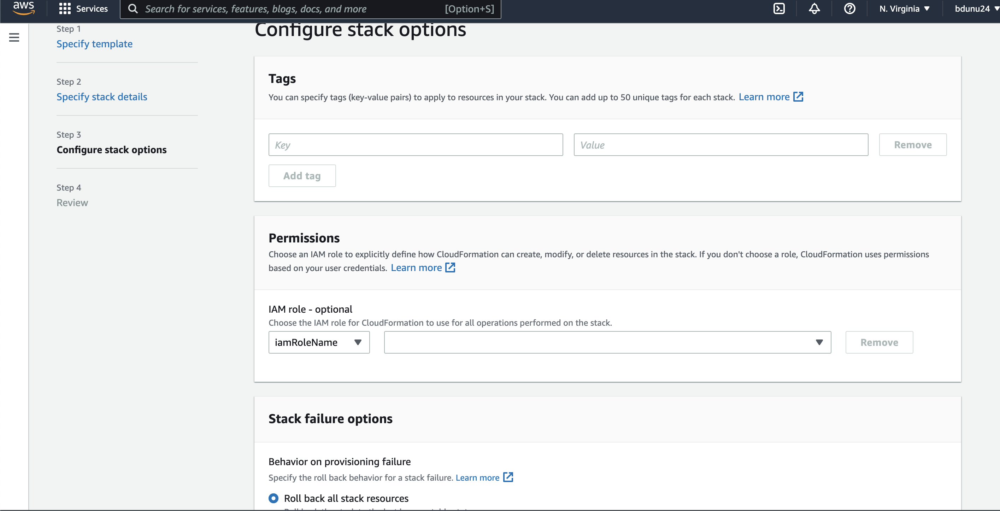

# Monolith-Application-into-Microservices

## Introduction

Hello, and welcome! 

In today’s project we’ll be deploying a monolithic node .js application to a Docker container. Then, we will be breaking the monolith application into microservices, with zero downtime. The node.js application will host a simple message board with threads and messages communicating between users.

### What is a Monolith? Why Migrate to Microservices?

A **monolith** is an application that’s a single unit of deployment, handling multiple kinds of business services. It is usually all tightly grouped together. Difficulties may potentially arise as an application’s code base grows––it becomes complicated to update and maintain, which makes a traditional monolithic architecture hard to scale.

On the other hand, **microservices** take each core of those business services, and deploy as its own separate unit, which preforms only a single function. They communicate with other services through a well-defined Application Programming Interface (API). Microservices can be written using different frameworks and programming languages, and you can deploy them independently, as a single service, or as a group of services.

Both the monolithic and miniservices applications are secured and maintained using containers. **Containers** provide a standard way to package your application's code, configurations, and dependencies into a single object. Containers share an operating system installed on the server and run as resource-isolated processes, ensuring quick, reliable, and consistent deployments, regardless of environment. 

### Why use containers?

**Containers** are a powerful way for developers to package and deploy their applications. Some benefits of using them are:

- **Less overhead**
    >> Containers require less system resources than traditional or hardware virtual machine environments because they don’t include operating system images.

- **Increased portability**
    >> Applications running in containers can be deployed easily to multiple different operating systems and hardware platforms.

- **More consistent operation**
    >> DevOps teams know applications in containers will run the same, regardless of where they are deployed.

- **Greater efficiency**
    >> Containers allow applications to be more rapidly deployed, patched, or scaled.

- **Better application development**
    >> Containers support agile and DevOps efforts to accelerate development, test, and production cycles.

# Part One: System Setup

As mentioned in the beginning, we'll be breaking a monolith application into microservices. Prior to this, we'll need to ensure we have access to a few software and tools. Let's get started!

### Step One: Creating an Amazon Web Services (AWS) Account

If you do not already have an AWS account set up, please create a free one [here](https://portal.aws.amazon.com/gp/aws/developer/registration/index.html). 

### Step Two: Installing Docker

Next, we'll install Docker. Docker is an open-source project for automating the deployment of applications as portable, self-sufficient containers that can run on the cloud or on-premises. We'll use this to build the image files that will run in our containers. 

Follow either the [Mac](https://docs.docker.com/docker-for-mac/install/) or [Windows](https://docs.docker.com/docker-for-windows/install/) instructions to have this downloaded to your desktop.

Once installed we can verify it is running by entering the following command in the terminal:

    docker --version

The version number should display as below: 

### Step Three: Installing the AWS Command Line Interface (CLI)

The AWS CLI is what we'll be using to push the images to Amazon ECR. Please follow this [guide](http://docs.aws.amazon.com/cli/latest/userguide/installing.html) to download and learn more about AWS CLI. 

Once downloaded and installed, verify that it is running on your terminal by running:

    aws --version

 If you already have AWS CLI installed, run the following command in the terminal to ensure it is updated to the latest version:

    $ pip3 install awscli --upgrade --user

### Step 4: Downloading a Text Editor for Coding

If you don't already have a text editor for coding, install one to your local environment! Both [Atom](https://atom.io/) and [Visual Studio Code](https://code.visualstudio.com/) are simple, open-source text editors that are popular with developers.

For today's example, we'll utilize VS Code.

### Step 5: Downloading the Repository from Github

If you haven't already created an account with Github, go ahead and do so [here](https://github.com/).

Next, log into your account and navigate to the following repo on your web browser: https://github.com/awslabs/amazon-ecs-nodejs-microservices

Select 'Code' and then click 'clone link,' in order to download the GitHub repository to your local environment.

There are two ways to clone your repo:

1. Open up your text-editor and use the 'Clone Repository' tab on the left-hand side. You'll have the option of entering in your cloned URL from github there. You may be asked where on your PC you'd like to save your repository. Once you do so, you will have access to the *amazon-ecs-nodejs-microservices* repository we cloned from Github.

2. You can clone the repo to your Terminal, using the following command:

    $ git clone <clone-link>

### Step Six: Creating the Repository on AWS

Now head to the [Amazon ECR console](https://console.aws.amazon.com/ecs/home?#/repositories) and select **Create Repository.**

On the Create repository page, enter the following name your repository: *api*

Leave the remainder of the options as default settings, then select *Create Repository*.

Once the repository is created, you'll notice a confirmation message displayed, showing the repository address. The repository address is in the following format: [account-ID].dkr.ecr.[region].amazonaws.com/[repo-name].

 **Disclaimer:** Things in brackets, such as the [account-ID], [region], and [repo-name] will be unique to your setup.

Next, access your terminal and navigate to the following directory:

    cd ~/amazon-ecs-nodejs-microservices/2-containerized/services/api.

Once you're in the directory, use the following command to configure your account:

    $ aws configure

Replace the following sample values below with your own values:

    AWS Access Key ID [None]: Access Key
    AWS Secret Access Key [None]: Secret Key
    Default region name [None]: <your preferred region>
    Default output format [None]: json

For additional help with AWS configuration, click [here](https://docs.aws.amazon.com/cli/latest/userguide/cli-configure-quickstart.html):

### Step Seven: Using the Terminal to Authenticate Docker Log-In

1. In your terminal, run:

    $ aws ecr get-login-password \
        --region <region> \
    | docker login \
        --username AWS \
        --password-stdin <aws_account_id>.dkr.ecr.<region>.amazonaws.com

2. To build the image, run the following command in the terminal:

    $ docker build -t api .

3. After the build completes, tag the image so you can push it to the repository:

    $ docker push [account-id].dkr.ecr.[region].amazonaws.com/api:latest

**Disclaimer:** Please remember to replace values within brackets, such as the [account-ID] and [region], as they will be unique to your setup.

4. Push the image to Amazon ECR by running the following:

    $ docker push [account-id].dkr.ecr.[region].amazonaws.com/api:latest

If you navigate to your Amazon ECR repository, you should now see your image tagged:

# Part Two: Deploying the Monolith

In part two, we'll be using Amazon Elastic Container Service (Amazon ECS) to instantiate a managed cluster of EC2 compute instances and deploy our image as a container running on the cluster. 

We'll begin by creating an Amazon ECS cluster deployed behind an Application Load Balancer.

1. Navigate to the AWS CloudFormation console and select **Create stack.**

Select on **Upload a template file** and choose the ecs.yml file from the GitHub project at amazon-ecs-nodejs-microservice/2-containerized/infrastructure/ecs.yml––then select **Next.**

Enter *BreakTheMonolith-Demo* as the stack name. Once completed, verify that the other parameters have the following values:

- **Desired Capacity** = *2*
- **InstanceType** = *t2.micro*
- **MaxSize** = *2*

Select **Next**

On the Configure stack options page, keep the default options and scroll down and select **Next.**

7. On the **Review BreakTheMonolith-Demo** page, scroll to the bottom of the page. Acknowledge the **Capabilities** statement by selecting the checkbox, and select **Create stack**.

You will see your stack with the status *CREATE_IN_PROGRESS.* This process typically takes under 5 minutes. You can select the refresh button at the top right of the screen to check on the progress.

Alternatively, you can use the AWS CLI to deploy AWS CloudFormation stacks. Run the following code in the terminal from the folder amazon-ecs-nodejs-microservices/3-microservices and replace [region] with your AWS Region:

    $ aws cloudformation deploy \
   --template-file infrastructure/ecs.yml \
   --region [region] \
   --stack-name BreakTheMonolith-Demo \
   --capabilities CAPABILITY_NAMED_IAM

2. Ensure that your Cluster is Running

Navigate to the [Amazon ECS console](https://console.aws.amazon.com/ecs/home?). Your cluster should appear in the list:

Select the cluster **BreakTheMonolith-Demo**, then select the **Tasks** tab to verify that there are no tasks running:

Select the ECS Instances tab to verify there are two Amazon EC2 instances created by the AWS CloudFormation template:

3. Writing Task Definitions

- From the **Amazon ECS** left navigation menu, select **Task Definitions**, then **Create new Task Definition**.

- On the **Select launch type compatibility** page, select the **EC2** option then select **Next step**.

- On the **Configure task and container definitions** page, proceed with the following:

    - In the **Task Definition Name** field, enter *api*.

    - Scroll down to **Container Definitions** and select **Add container**.

    - In the **Add container** window:

        - Parameters that are not defined can be either left blank or with the default settings.

        - In the **Container name** field, enter *api*.

        - In the **Image** field, add the following, replacing the values in brackets with your specific values:

             [account-ID].dkr.ecr.[region].amazonaws.com/api:latest
    
